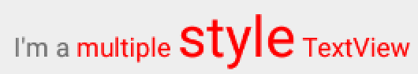
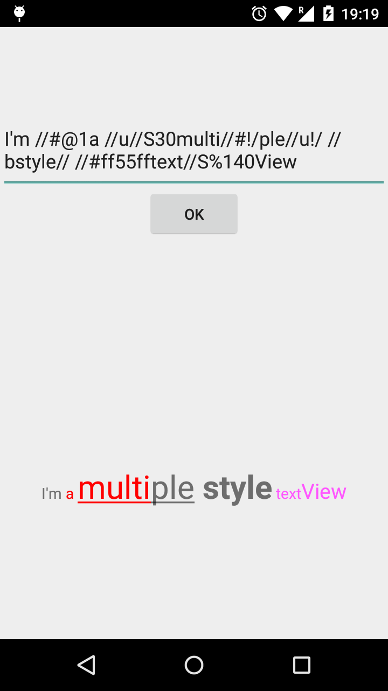

MultiStyleTextView
==================

This library provide a simple way to display multiple styles in one TextView.

## Size:

```xml
    <com.linfaxin.multistyletextview.MultiStyleTextView
        ...
        android:text="I'm a //S30multiple style Text//S%80View"
        />
```
//S30 means 30dp

//S%80 means 80% size


## Color:

```xml
    <com.linfaxin.multistyletextview.MultiStyleTextView
        ...
        app:color1="#ff0000"
        android:text="I'm a //#@1multiple style Text//#00ff00View"
        />
```
//#@1 means use color1

//#00ff00 means use color: #00ff00


## Other:

//U : UnderLine

//B : BoldStyle

//L : DeleteLine

## End a style


```xml
    <com.linfaxin.multistyletextview.MultiStyleTextView
        ...
        app:color1="#ff0000"
        android:text="I'm a //#@1multiple style// Text//S30View"
        />
```
use "//" end all style defined


```xml
    <com.linfaxin.multistyletextview.MultiStyleTextView
        ...
        app:color1="#ff0000"
        android:text="I'm a //#@1multiple //S30style//S!/ TextView"
        />
```
use "//S!/" end size style, use "//#!/" end color style, ...




## All Style:


